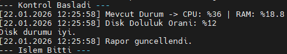
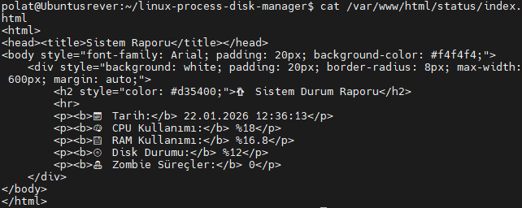

# 🐧 Linux Process & Disk Manager


> **Sistem kaynaklarını optimize eden, kritik durumlarda disk temizliği yapan ve HTML formatında profesyonel raporlar sunan otonom sistem yöneticisi.**

---

## ⚠️ Yasal Uyarı (Disclaimer)
Bu yazılım sistem dosyaları üzerinde değişiklik yapma ve dosya silme (cache/log temizliği) yetkisine sahiptir. Her ne kadar güvenli protokoller kullanılsa da, **kritik verilerinizin yedeğini almadan** üretim ortamında (production) kullanmanız önerilmez. Oluşabilecek veri kayıplarından kullanıcı sorumludur.

---

## 📖 Proje Hakkında

Bu proje, Linux tabanlı sunucu ve istemcilerde sistem sağlığını (CPU, RAM, Disk) izleyen, belirlenen eşik değerler aşıldığında **otonom** kararlar alarak sistemi temizleyen ve yöneticiye görsel bir rapor sunan profesyonel bir otomasyon aracıdır.

**Öne Çıkan Yetenekler:**
* **Akıllı İzleme:** Sistem kaynaklarını anlık olarak takip eder.
* **Otonom Temizlik:** Disk dolduğunda manuel müdahaleye gerek kalmadan gereksiz dosyaları temizler.
* **Zombie Avcısı:** Sistem kaynaklarını tüketen ölü süreçleri (zombie process) tespit eder ve sonlandırır.
* **Görsel Raporlama:** Tüm analizleri modern bir HTML arayüzünde sunar.

---

## 📺 Proje Tanıtım ve Sunum

[](https://youtu.be/2ITEi6EUJ-o)

> 📥 **[Detaylı Sunum Dosyasını İndir (.pptx)](./Linux_Process_and_Disk_Manager_PolatTren.pptx)**

---


## ✨ Temel Özellikler

| Modül | Fonksiyon |
| :--- | :--- |
| **🚀 Auto-Monitor** | CPU ve RAM kullanımını anlık izler, anormallik durumunda log kaydı oluşturur. |
| **🧹 Disk-Cleaner** | Disk kullanımı **%90**'ı aştığında cache, tmp ve log dosyalarını güvenli protokollerle temizler. |
| **🧟 Zombie-Hunter** | Performans kaybına neden olan zombie süreçleri tespit eder. |
| **📊 HTML Reporting** | Yönetici için CSS ile stillendirilmiş `index.html` formatında sağlık raporu üretir. |
| **⏰ Cron Automation** | Kurulum sonrası crontab entegrasyonu ile arka planda sessizce çalışır. |

---

## 📂 Proje Yapısı
* `src/`: Ana otomasyon scripti (`main.sh`) ve kurulum aracı (`install.sh`).
* `specs/`: Proje meta verilerini içeren standart JSON dosyası.
* `researchs/`: Geliştirme öncesi yapılan derinlemesine teknik araştırmalar.
* `*.pptx`: Projenin detaylı sunum dosyası.

---

## 📸 Proje Görselleri

<div align="center">
  <h3>1. Yönetici Terminal Arayüzü</h3>
  
  <p><em>Kullanıcı dostu, renkli ve modüler terminal menüsü.</em></p>
  
  <br>
  
  <h3>2. HTML Sistem Sağlık Raporu</h3>
  
  <p><em>Sistem durumunu tarayıcı üzerinden analiz edebileceğiniz detaylı rapor.</em></p>
</div>

---

## 🚀 Kurulum ve Hızlı Başlangıç

Projeyi yerel makinenize klonlayın ve kurulum sihirbazını başlatın.

### 1. Projeyi İndirin
```bash
git clone https://github.com/polattren/linux-process-disk-manager.git
cd linux-process-disk-manager
```
### 2. Kurulumu Başlatın
install.sh dosyası gerekli izinleri ayarlayacak ve cron job tanımlamalarını yapacaktır.
```
chmod +x src/*.sh  # Çalıştırma izni ver (eğer yoksa)
sudo ./src/install.sh
```
### 3. Manuel Çalıştırma (Opsiyonel)
Otomasyonu beklemeden aracı hemen test etmek için:
```
sudo ./src/main.sh
```
### Kaldırma (Uninstall)
Sisteminizden otomasyonu ve projeyi kaldırmak isterseniz:
1. Crontab listesini açın:
```
sudo crontab -e
```
2. Listenin en altındaki proje ile ilgili satırı silip kaydedin.
3. Proje klasörünü silebilirsiniz.


